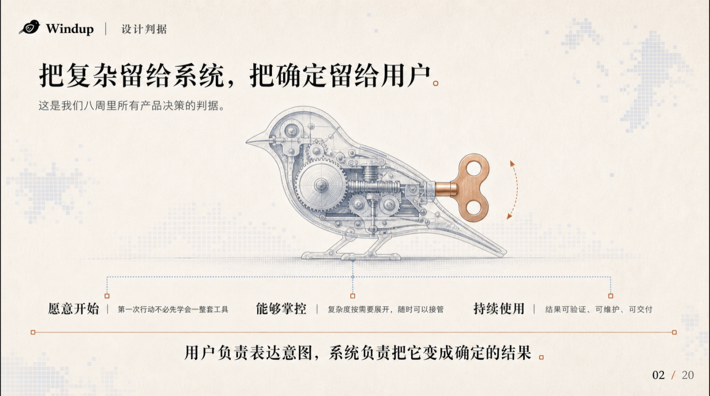
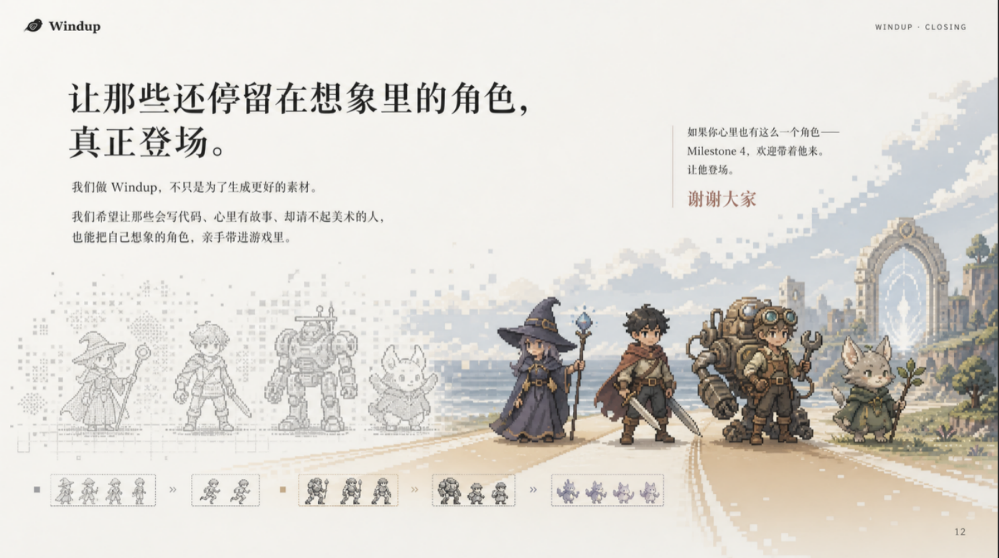

# 作品示例

以下四张图由维护者提供用于公开展示，来自群学致知与 Windup 的既有演示作品。这里只展示视觉参考，不将其宣称为本次公开技能包的新生成结果，不从图片外观推断对象可编辑程度。

## 群学致知：产品入口

纸张与山水材质、清晰的中文层级，以及产品界面与项目气质的结合。

## Windup：设计判断

用完整的机械鸟视觉主体组织判断与说明，少量颜色区分层级。

## Windup：开场

角色动作、产品界面与标题共同讲述产品，而不是把品牌色附在普通模板上。

## Windup：收束

沿用角色与像素语言，保持开场到结尾的视觉连续性。

## 使用边界

这些图是用户提供的参考文件，未在本次发布中重新采集屏幕。图中项目、人物、品牌和第三方标识不表示其认可或赞助 Pitchcraft。

本目录作品与 `docs/assets/` 品牌素材不适用仓库代码的 MIT 许可证；保留各权利人的权利。展示不授予提取、改作或商业复用其中项目资产的许可。请用自己的内容调用工作流。
